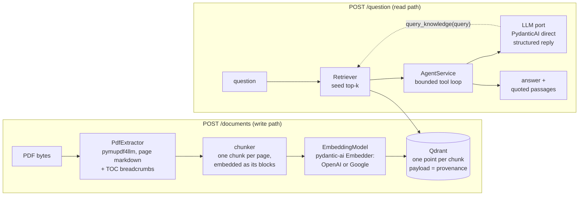

# RAG Agent: question answering over PDF manuals

Upload PDFs, ask questions in any language, get grounded answers together
with the exact excerpts they came from. Built for an ML Engineering
interview challenge ([brief](docs/challenge.pdf)), and built **eval-first**:
every retrieval and prompt change is measured against a hand-authored
golden dataset before it is kept. From day one the repo has carried a
**wiki-style knowledge base for the AI coding agents** that helped develop
it. The [documentation section](#documentation-a-wiki-for-the-agents-that-built-this)
explains how it is organized.


## Quickstart

You need Docker, an OpenAI API key and a Gemini API key. Nothing else.

```bash
git clone <this repo> && cd rag-agent
cp .env.example .env        # put your keys in OPENAI_API_KEY and GEMINI_API_KEY
make up                     # builds the image, starts Qdrant + API in the foreground
```

With the stack running, send any PDF to `POST /documents`. Repeat `-F`
to upload several at once. The repo ships four real motor manuals in
`case_files/` (WEG and Baldor, Portuguese and English) if you want
something to try:

```bash
curl -s -F "files=@case_files/LB5001.pdf" http://localhost:8000/documents
```

The response reports how many documents and chunks were indexed, and the
`make up` terminal logs each file's progress while it is ingested. Then
ask:

```bash
curl -s -X POST http://localhost:8000/question \
        -H 'Content-Type: application/json' \
        -d '{"question": "What grease should I use to relubricate the motor bearings?"}'
```

Interactive OpenAPI docs live at <http://localhost:8000/docs>.

## The API

| Endpoint          | Request                                               | Response                                                                                                  |
| ----------------- | ----------------------------------------------------- | --------------------------------------------------------------------------------------------------------- |
| `POST /documents` | `multipart/form-data`, one or more PDFs under `files` | `{"message", "documents_indexed", "total_chunks"}`                                                        |
| `POST /question`  | `{"question": "..."}`                                 | `{"answer", "references": [verbatim excerpts the answer cites]}`                                          |
| `GET /health`     | —                                                     | `{"status", "vector_store", "indexed_chunks", "llm_model", "embedding_model"}`; `503` when Qdrant is down |

Configuration mistakes fail before any request: `make check-env` refuses an
empty key, and the API validates the models, the keys and the vector store
at startup, so a wrong `.env` shows up in the `make up` terminal as
`startup failed: …`. When something fails later, `GET /health` says which
dependency is down. Re-uploading a file is idempotent: chunk ids are
content-addressed, so the index never accumulates duplicates.

### Example requests and responses

Real outputs from the running stack (`openai:gpt-5-mini`, the four manuals
from `case_files/` indexed, captured 2026-09-04). Each reference is a
passage the model quoted verbatim from a page it read, verified by
containment before it is returned. It is never a whole page, never invented.

**The Quickstart question**, answered from the Baldor manual:

```json
{ "question": "What grease should I use to relubricate the motor bearings?" }
```

```json
{
  "answer": "Baldor motors are normally pregreased with Polyrex EM (Exxon Mobil); if other greases are preferred, check with a local Baldor Service Center. Also: “Keep grease clean. Mixing dissimilar grease is not recommended.”",
  "references": [
    "Baldor motors are pregreased, normally with Polyrex EM (Exxon Mobil). If other greases are preferred, check with a local Baldor Service Center for recommendations.",
    "Caution: Keep grease clean. Mixing dissimilar grease is not recommended."
  ]
}
```

**The same question in Portuguese.** The answer follows the language of
the question, and the references keep the words of the source (an English
manual). Reading and answering are separate concerns:

```json
{ "question": "Qual graxa devo usar para relubrificar os rolamentos do motor?" }
```

```json
{
  "answer": "Use, preferencialmente, Polyrex EM (Exxon Mobil). Se optar por outra graxa, consulte um Centro de Serviço Baldor; e evite misturar graxas diferentes.",
  "references": [
    "Baldor motors are pregreased, normally with Polyrex EM (Exxon Mobil). If other greases are preferred, check with a local Baldor Service Center for recommendations.",
    "Caution: Keep grease clean. Mixing dissimilar grease is not recommended."
  ]
}
```

When the indexed documents do not support an answer the agent refuses in
the question's language and returns an empty `references` list. It never
invents a source:

```json
{ "question": "Qual é a capital da Austrália?" }
```

```json
{
  "answer": "Desculpe, os documentos fornecidos não contêm essa informação.",
  "references": []
}
```

Questions take a few seconds each (mean 6.4 s, p95 10.4 s over the 93-case
eval at 8 workers): one or two LLM calls plus retrieval, with the model
writing out the passages it quotes. The model reasons at low effort by
default (`LLM_THINKING`).

## How it works



The codebase is a **ports & adapters "lite"**: a framework-free domain
(`src/domain`: dataclass entities, `typing.Protocol` ports, two domain
services) surrounded by adapters per pipeline stage, wired in one
composition root at the API edge. The point is cheap experiments: swapping
the PDF extractor, the embedder, the retrieval strategy or the LLM provider
is a one-line change, and the evals decide whether it stays.

### Ingestion: from PDF bytes to searchable chunks

`pymupdf4llm` extracts each page as markdown. Two cleaning passes wrap
that extraction; both replaced a naive baseline that scored worse:

- **Font repair (before extraction).** Some PDFs embed fonts with no
  Unicode map, so those pages decode as runs of `�` instead of real text.
  We rebuild the missing map from Arial's standard glyph order before
  extraction runs. On one manual this took the garbled character count
  from 71,618 down to 41, with no OCR involved.
- **Page cleaning (after extraction).** Running headers, page numbers and
  dot leaders are stripped before anything reaches the embedder, so they
  don't compete with real content for similarity.

Chunking stayed deliberately simple: **one chunk per page**, no
fixed-size splitting, no overlap. Underneath that, each page is also
split into small units (paragraphs and table rows), and each unit gets
its own embedding. Qdrant stores all of a page's unit vectors on **one
multivector point**, scored by its best-matching unit (MaxSim). That
means a page is *found* by its most specific sentence, but *returned*
whole, so the model gets full context without losing precision. It's
small-to-big retrieval, without needing a separate parent index.

Every one of these choices replaced something that measured worse. The
[scoreboard](#scoreboard) below shows what each one bought.

### Retrieval: from a question to a grounded answer

A question first gets a deterministic top-k search (`RETRIEVAL_K=5`,
MaxSim over the stored multivectors). The retrieved chunks are rendered
as XML in the model's system prompt, one `<chunk>` per page. Here is a
trimmed example: this is what the model saw before answering the
Quickstart's grease question above.

```xml
<chunk document="LB5001.pdf" page="2">
  <text>
  Baldor motors are pregreased, normally with Polyrex EM (Exxon Mobil). If
  other greases are preferred, check with a local Baldor Service Center
  for recommendations.

  Caution: Keep grease clean. Mixing dissimilar grease is not recommended.
  </text>
</chunk>
```

(A `<section>` element is added above `<text>` for pages that have one:
either from the PDF's own outline, or from a markdown heading.)

If the seed chunks aren't enough, the model can call a `query_knowledge`
tool, up to 3 rounds, to search again with a reformulated query
(synonyms, the other language, a more technical term) before giving up.

The final turn is a **provider-enforced structured reply** with three
fields: `answer`, `has_answer`, and `citations`. Citations are passages
the model must copy **verbatim** from the `<text>` it read, character for
character, never paraphrased or translated. This is exactly how the two
references in the grease example above were produced. We do not trust
the model's word for where a quote came from: every citation is resolved
afterwards by checking, line by line, that it is actually contained in a
chunk the model saw. A citation that fails that check is dropped rather
than guessed at, so `references` never carries invented or approximate
text, or a whole page when a sentence would do. The prompt is a
deliberate, reviewed artifact in `src/domain/services/prompts.py`. The
design behind this citation scheme, including what it costs, is in the
[answer layer](#answer-layer) below.

```
src/domain/       entities, ports (Protocols), AgentService, IngestionPipelineService, prompts (pure Python)
src/ingestion/    pymupdf4llm extractor, chunker
src/retrieval/    embedder (OpenAI or Gemini), Qdrant multivector store, VectorRetriever
src/llm/          PydanticAiLLM adapter (structured output, function-derived tools)
src/api/          FastAPI routes + composition root
src/evaluation/   the eval harness (loader, matching, metrics, report, CLI)
evals/            golden dataset (93 cases) and committed results
tests/            domain services against fakes, adapters, routes and seam integration
docs/            the knowledge bundle (see below)
```

## Eval-first

Accuracy is measured, not assumed.

- **Golden dataset**: 93 hand-authored question → ideal-answer cases over
  the four manuals ([overview](evals/golden/golden-dataset.md)): operator
  and technical personas, table and figure lookups, cross-lingual cases
  (English manuals asked in Portuguese and vice-versa), and 8 unanswerable
  controls. Ground truth is verbatim excerpts plus page, never chunk ids,
  so it survives any change in chunking.
- **Metrics.** Deterministic **gates** decide experiments: recall@5,
  hit_rate@5, MRR@5. Diagnostics (precision@5, per-slice breakdowns by
  document, language, persona and category) explain the numbers but never
  gate.
- **The rule**: any change to chunking, embedding, retrieval or prompting
  ships with a before/after run committed to `evals/results/`.

```bash
make install                      # local venv, Python >= 3.12
make eval label=my-experiment     # runs against the eval collection, prints deltas vs the last run
make eval-fresh label=reindexed   # drop the eval collection and re-ingest first (after ingestion changes)
make eval-answers label=agent     # adds the answer layer: every case through the agent (LLM calls, a few minutes)
```

### Scoreboard

The table is alive: every kept experiment adds a row, with its committed
results file as evidence. The goal is to leave the best numbers we can
reach here.

| Iteration                                                                                                                                                                                                    | Date       | Results                                                                                          | recall@5 | hit_rate@5 |    MRR@5 |
| ------------------------------------------------------------------------------------------------------------------------------------------------------------------------------------------------------------ | ---------- | ------------------------------------------------------------------------------------------------ | -------: | ---------: | -------: |
| **Baseline**: pymupdf4llm extraction, fixed 1000/200 chunks, `text-embedding-3-small`, top-5 vector search                                                                                                  | 2026-09-01 | [`20260901-190240-baseline.json`](evals/results/20260901-190240-baseline.json)                   |     0.65 |       0.66 |     0.60 |
| **Font repair**: fonts lacking a ToUnicode map get one from Arial's glyph order before extraction; CESTARI stops indexing `�` (no OCR)                                                                      | 2026-09-02 | [`20260902-035239-font-repair.json`](evals/results/20260902-035239-font-repair.json)             |     0.78 |       0.80 |     0.70 |
| **Page cleaning**: running headers, page numbers, dot leaders and picture-text markers stripped                                                                                                             | 2026-09-02 | [`20260902-035640-page-cleanup.json`](evals/results/20260902-035640-page-cleanup.json)           |     0.80 |       0.81 |     0.71 |
| **Structured chunks**: markdown blocks packed to ~1200 chars, sentences and tables never split, sections from headings where the PDF has no outline                                                         | 2026-09-02 | [`20260902-041707-structured-chunks.json`](evals/results/20260902-041707-structured-chunks.json) |     0.79 |       0.81 |     0.71 |
| **Contextualized embeddings**: document, section and heading prefixed to the text the embedder sees; stored chunk unchanged                                                                                 | 2026-09-02 | [`20260902-041913-embed-context.json`](evals/results/20260902-041913-embed-context.json)         |     0.81 |       0.83 |     0.76 |
| **Page chunks, small units**: one chunk per page; its paragraphs and table rows are embedded as separate vectors on the same Qdrant point (MaxSim), so a specific value is found and the whole page is read | 2026-09-02 | [`20260902-045635-page-multivector.json`](evals/results/20260902-045635-page-multivector.json)   |     0.86 |       0.86 |     0.79 |
| **Multilingual embedder**: `EMBEDDING_MODEL=google:gemini-embedding-001` (3072 dims) instead of `text-embedding-3-small`; six of the eleven Portuguese-question-over-English-manual misses recovered        | 2026-09-02 | [`20260902-052352-gemini-embedding.json`](evals/results/20260902-052352-gemini-embedding.json)   | **0.95** |   **0.95** | **0.91** |

Gates are computed over the 83 gated cases (93 minus 8 unanswerable
controls and 2 image-only diagnostics).

#### Answer layer

Same dataset, the whole `/question` path (seed retrieval → `gpt-5-mini`
→ structured reply), scored deterministically: fact recall over the
cases' `expected_facts`, citation precision and recall over the cited
`(document, page)` pairs, refusal rate over the 8 unanswerable controls.
No LLM judge. Red cases are read by hand from the per-case JSON.

| Iteration                                                                                                                                                      | Results                                                                                                         | fact recall | citation precision | citation recall | refusals | latency (mean) |       cost |
| --------------------------------------------------------------------------------------------------------------------------------------------------------------- | ----------------------------------------------------------------------------------------------------------------- | ----------: | ------------------: | ---------------: | -------: | --------------: | ----------: |
| **Chunk ids**: the model cites a chunk id per claim; provider-default reasoning effort                                                                          | [`20260902-202721-agent-tool-on.json`](evals/results/20260902-202721-agent-tool-on.json)                          |    **0.93** |                 0.70 |         **0.92** |      6/8 |          11.7 s |    ≈ $0.22 |
| **`query_knowledge` tool off**: same as above, the retrieval tool disabled; kept **on** going forward, it recovers cases the seed alone misses                  | [`20260902-203011-agent-tool-off.json`](evals/results/20260902-203011-agent-tool-off.json)                        |        0.92 |                 0.73 |             0.91 |      7/8 |          10.5 s |    ≈ $0.18 |
| **Verbatim quotes**: citations become passages copied from `<text>`, resolved by containment ([Decision 0013](docs/decisions/0013-citations-as-quotes.md))     | [`20260902-221750-citations-as-quotes.json`](evals/results/20260902-221750-citations-as-quotes.json)              |        0.92 |                 0.78 |             0.90 |      7/8 |          16.0 s |    ≈ $0.29 |
| **Low reasoning effort**: `LLM_THINKING=low` instead of the provider default                                                                                    | [`20260903-010828-thinking-low.json`](evals/results/20260903-010828-thinking-low.json)                            |        0.91 |                 0.79 |             0.86 |      7/8 |       **5.9 s** |       $0.18 |
| **Language reminder in the prompt**: explicit rule to answer in the question's language regardless of the chunks' language                                     | [`20260904-033639-prompt-language-reminder.json`](evals/results/20260904-033639-prompt-language-reminder.json)    |        0.91 |             **0.81** |             0.90 |      6/8 |           6.4 s |   **$0.14** |

Costs marked ≈ are computed after the fact from each run's recorded
tokens with the same price table; the last row's is recorded by the run
itself (embedding calls excluded, three orders of magnitude smaller).

Fact recall and citation recall dip a little, 0.01 to 0.02, from the
first row to the last. That's inside the ±0.03 run-to-run noise this
93-case dataset carries (see [Decision 0013](docs/decisions/0013-citations-as-quotes.md)).
Citation precision, latency and cost move well past that noise: verbatim,
containment-checked citations raised precision from 0.70 to 0.81, and
dropping the reasoning effort to `low` cut mean latency by more than
half, at no real cost to the other metrics.

## Engineering practices

- **TDD for the code itself.** Distinct from the evals above, which
  measure whether the system answers well, the test suite checks that
  each module does what it was designed to do. Every module and every
  seam between modules was written red-green-refactor: domain services
  against fakes of their ports, adapters on their own, routes with
  dependency overrides, seams on an in-memory Qdrant. External services
  are faked here; their real behavior is the evals' job. `make test` runs
  the suite in seconds.
- **Typed.** `make typecheck` runs pyright in `standard` mode: zero
  errors, no blanket ignores.
- **Comment-free code, documented decisions.** Rationale lives in the
  knowledge bundle next to the code it explains, not in comments that
  drift.
- **Runs on Python 3.12, 3.13 and 3.14** with the same pinned
  requirements; the image ships 3.14.

## Configuration

Copy `.env.example` to `.env`. Only the two API keys are required.

| Variable                  | Default                       | What it does                                                                                                                                                                                                                                                                                                                  |
| ------------------------- | ----------------------------- | ----------------------------------------------------------------------------------------------------------------------------------------------------------------------------------------------------------------------------------------------------------------------------------------------------------------------------- |
| `OPENAI_API_KEY`          | —                             | The primary LLM (`gpt-5-mini`) and the OpenAI embedding models. **Required.**                                                                                                                                                                                                                                                 |
| `GEMINI_API_KEY`          | —                             | Embeddings (`gemini-embedding-001`) and the fallback LLM. **Required.**                                                                                                                                                                                                                                                       |
| `LLM_MODEL`               | `openai:gpt-5-mini`           | Any PydanticAI model string; `openai:` is the Responses API, `openai-chat:` Chat Completions.                                                                                                                                                                                                                                 |
| `LLM_FALLBACK_MODEL`      | `google:gemini-3.5-flash`     | Tried when the primary model fails with a provider error (4xx, 5xx, connection). Blank disables the fallback.                                                                                                                                                                                                                 |
| `LLM_THINKING`            | `low`                         | Reasoning effort of the LLM (`minimal`, `low`, `medium`, `high`, `xhigh`, `off`; blank keeps the provider default). Applies to the primary and the fallback model. At the provider default reasoning tokens were 85–94 % of the output and most of the latency; `low` cut the mean answer time by more than half on the eval. |
| `EMBEDDING_MODEL`         | `google:gemini-embedding-001` | `google:gemini-embedding-001` (the measured best, see the scoreboard), `openai:text-embedding-3-small` or `openai:text-embedding-3-large`; changing the model requires re-indexing (delete the collection, the store refuses a mismatched one).                                                                               |
| `RETRIEVAL_K`             | `5`                           | Chunks per retrieval (seed and tool calls).                                                                                                                                                                                                                                                                                   |
| `AGENT_MAX_TOOL_ROUNDS`   | `3`                           | Cap on `query_knowledge` rounds per question; `0` disables the tool.                                                                                                                                                                                                                                                          |
| `QUERY_KNOWLEDGE_ENABLED` | `true`                        | Offer the retrieval tool to the model at all.                                                                                                                                                                                                                                                                                 |
| `QDRANT_URL`              | `http://localhost:6333`       | Host-side default; inside compose the API talks to the `qdrant` service.                                                                                                                                                                                                                                                      |
| `QDRANT_COLLECTION`       | `chunks`                      | Production collection.                                                                                                                                                                                                                                                                                                        |
| `EVAL_QDRANT_COLLECTION`  | `eval_chunks`                 | Separate collection the eval harness indexes and reads.                                                                                                                                                                                                                                                                       |

The LLM has a provider fallback: when the primary model fails with a
provider error, the same request is retried on `LLM_FALLBACK_MODEL`
(PydanticAI's `FallbackModel`); if every model fails the API answers 502
naming each model's error. The OpenAI and Google extras are both installed.

## Documentation: a wiki for the agents that built this

This repository was developed with AI coding agents, and we chose from the
very first commit to sustain it with a **wiki-style knowledge base written
for those agents**. The whole repo is one knowledge bundle in the
[Open Knowledge Format](docs/okf-spec.md): every `.md` file carries typed
frontmatter, module knowledge sits next to the module's code, and every
change to the bundle is logged. It holds what the code cannot say: why
things are shaped this way, what was rejected, what was measured. That
way each new agent session (and each human reader) starts with the same
context instead of reverse-engineering it from git history.

The bundle is curated: the owner is its editor, approves every new
concept before it is written, and stamps what he has reviewed
(`verified`). Agents propose, humans decide.

Some of the documentation worth a look:

- [`docs/architecture.md`](docs/architecture.md): the operating map of
  the codebase (shape, rules, how to extend it).
- [`docs/decisions/`](docs/decisions/index.md): the decision records,
  each with context, alternatives rejected and consequences.
- Module notes next to the code, such as
  [`src/ingestion/ingestion.md`](src/ingestion/ingestion.md) and
  [`src/evaluation/evaluation.md`](src/evaluation/evaluation.md).
- [`log.md`](log.md): the bundle's changelog, newest first. The story of
  the project in one page.
