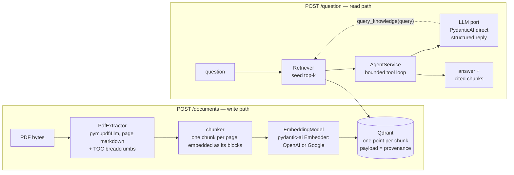

# RAG Agent — question answering over PDF manuals

Upload PDFs, ask questions in any language, get grounded answers together
with the exact excerpts they came from. Built for an ML Engineering
interview challenge ([brief](docs/challenge.md)), and built **eval-first**:
every retrieval and prompt change is measured against a hand-authored
golden dataset before it is kept. From day one the repo has carried a
**wiki-style knowledge base for the AI coding agents** that helped develop
it — the [documentation section](#documentation-a-wiki-for-the-agents-that-built-this)
explains how it is organized.


## Quickstart

You need Docker, an OpenAI API key and a Gemini API key. Nothing else.

```bash
git clone <this repo> && cd rag-agent
cp .env.example .env        # put your keys in OPENAI_API_KEY and GEMINI_API_KEY
make up                     # builds the image, starts Qdrant + API in the foreground
```

With the stack running, send any PDF to `POST /documents` — repeat `-F`
to upload several at once. The repo ships four real motor manuals in
`case_files/` (WEG and Baldor, Portuguese and English) if you want
something to try:

```bash
curl -s -F "files=@case_files/LB5001.pdf" http://localhost:8000/documents
```

The response reports how many documents and chunks were indexed, and the
`make up` terminal logs each file's progress while it is ingested. Then
ask:

```bash
curl -s -X POST http://localhost:8000/question \
        -H 'Content-Type: application/json' \
        -d '{"question": "What is the power consumption of the motor?"}'
```

Interactive OpenAPI docs live at <http://localhost:8000/docs>.

## The API

| Endpoint          | Request                                              | Response                                                     |
| ----------------- | ---------------------------------------------------- | ------------------------------------------------------------ |
| `POST /documents` | `multipart/form-data`, one or more PDFs under `files` | `{"message", "documents_indexed", "total_chunks"}`           |
| `POST /question`  | `{"question": "..."}`                                | `{"answer", "references": [verbatim excerpts the answer cites]}` |
| `GET /health`     | —                                                    | `{"status": "ok"}`                                           |

Error semantics are deliberate: a non-PDF upload is a `422` naming the
offending file and nothing is indexed (all-or-nothing); a blank question is
a `422`; provider failures surface as `502` with the provider named.
Re-uploading a file is idempotent — chunk ids are content-addressed, so
the index never accumulates duplicates.

### Example requests and responses

Real outputs from the running stack (`openai:gpt-5-mini`, the four
manuals from `case_files/` indexed). References are shown truncated; the
API returns the full chunk text.

**The challenge's example question** — answered from the WEG guide's
conceptual section, in the question's language:

```json
{"question": "What is the power consumption of the motor?"}
```

```json
{
  "answer": "The motor's power consumption is the electrical power absorbed from the network (Pa). This absorbed power is always greater than the mechanical power available at the shaft (Pu) due to the motor's losses; the efficiency η is the ratio Pu / Pa.",
  "references": [
    "www.weg.net \n\n#### 1.2.6 Rendimento \n\nO rendimento define a eficiência com que é feita a conversão da energia elétrica absorvida da rede pelo motor, em energia mecânica disponível no eixo. …",
    "mostrado no tópico 1.2.6, em todos os motores elétricos, a potência elétrica absorvida é sempre maior que a potência mecânica disponível na ponta de eixo, ou seja, a potência consumida na rede elétrica é sempre maior que …"
  ]
}
```

**A maintenance question in Portuguese** — the answer separates the two
manuals that speak about grease:

```json
{"question": "Qual graxa devo usar para relubrificar os rolamentos do motor?"}
```

```json
{
  "answer": "Conforme os documentos fornecidos:\n- Para motores Baldor: usar Polyrex EM (Exxon Mobil) — os motores são pré-lubrificados com essa graxa; se optar por outra, consulte um Centro de Serviço Baldor (Baldor). (fonte: documento Baldor)\n- Para proteger retentores externos de redutores em períodos sem funcionamento (>6 meses): aplicar uma fina camada de graxa NLGI #2 EP, por exemplo Texaco Multifak EP2, e remover antes da operação. (fonte: manual WEG)",
  "references": [
    "… Lubrication interval for 6313 or 6314 bearings that are used in 360 through 5000 frame, 2 pole motors. If roller bearings are used, bearings must be lubricated more frequently …",
    "… O eixo de entrada do redutor deverá ser girado no mínimo duas voltas completas e este procedimento deverá ser repetido, no mínimo, 1 vez a cada 2 meses. …"
  ]
}
```

When the indexed documents do not support an answer (for example _"Qual é
a capital da Austrália?"_) the agent refuses in the question's language
and returns an empty `references` list — it never invents a source.
Questions take several seconds each (7–20 s observed): one or two LLM
calls plus retrieval.

## How it works



The codebase is a **ports & adapters "lite"**: a framework-free domain
(`src/domain`: dataclass entities, `typing.Protocol` ports, two domain
services) surrounded by adapters per pipeline stage, wired in one
composition root at the API edge. The point is cheap experiments: swapping
the PDF extractor, the embedder, the retrieval strategy or the LLM provider
is a one-line change, and the evals decide whether it stays.

Answering is **dual-path**: a deterministic seed retrieval puts the top-k
chunks in front of the model as an XML-rendered context, and the model may
call a `query_knowledge` tool (at most 3 rounds) against the same retriever
when the seed is not enough. The final turn is a **provider-enforced
structured reply** — answer text, the ids of the chunks it actually cites,
and a `has_answer` flag — so `references` carries exactly what grounded the
answer, never everything that was retrieved. The prompt is a deliberate,
reviewed artifact in `src/domain/services/prompts.py`, not a string buried
in a route.

```
src/domain/       entities, ports (Protocols), AgentService, IngestionPipelineService, prompts — pure Python
src/ingestion/    pymupdf4llm extractor, chunker
src/retrieval/    OpenAI embedder, Qdrant store, VectorRetriever
src/llm/          PydanticAiLLM adapter (structured output, function-derived tools)
src/api/          FastAPI routes + composition root
src/evaluation/   the eval harness (loader, matching, metrics, report, CLI)
evals/            golden dataset (93 cases) and committed results
tests/            domain services against fakes, adapters, routes and seam integration
docs/ specs/ research/   the knowledge bundle (see below)
```

## Eval-first

Accuracy is measured, not assumed.

- **Golden dataset** — 93 hand-authored question → ideal-answer cases over
  the four manuals ([overview](evals/golden/golden-dataset.md)): operator
  and technical personas, table and figure lookups, cross-lingual cases
  (English manuals asked in Portuguese and vice-versa), and 8 unanswerable
  controls. Ground truth is verbatim excerpts plus page, never chunk ids,
  so it survives any change in chunking.
- **Metrics** — deterministic **gates** decide experiments: recall@5,
  hit_rate@5, MRR@5. Diagnostics (precision@5, per-slice breakdowns by
  document, language, persona and category) explain the numbers but never
  gate.
- **The rule** — any change to chunking, embedding, retrieval or prompting
  ships with a before/after run committed to `evals/results/`.

```bash
make install                      # local venv, Python >= 3.12
make eval label=my-experiment     # runs against the eval collection, prints deltas vs the last run
make eval-fresh label=reindexed   # drop the eval collection and re-ingest first (after ingestion changes)
```

### Scoreboard

The table is alive: every kept experiment adds a row, with its committed
results file as evidence. The goal is to leave the best numbers we can
reach here.

| Iteration | Date | Results | recall@5 | hit_rate@5 | MRR@5 |
| --------- | ---- | ------- | -------: | ---------: | ----: |
| **Baseline** — pymupdf4llm extraction, fixed 1000/200 chunks, `text-embedding-3-small`, top-5 vector search | 2026-09-01 | [`20260901-190240-baseline.json`](evals/results/20260901-190240-baseline.json) | 0.65 | 0.66 | 0.60 |
| **Font repair** — fonts lacking a ToUnicode map get one from Arial's glyph order before extraction; CESTARI stops indexing `�` (no OCR) | 2026-09-02 | [`20260902-035239-font-repair.json`](evals/results/20260902-035239-font-repair.json) | 0.78 | 0.80 | 0.70 |
| **Page cleaning** — running headers, page numbers, dot leaders and picture-text markers stripped | 2026-09-02 | [`20260902-035640-page-cleanup.json`](evals/results/20260902-035640-page-cleanup.json) | 0.80 | 0.81 | 0.71 |
| **Structured chunks** — markdown blocks packed to ~1200 chars, sentences and tables never split, sections from headings where the PDF has no outline | 2026-09-02 | [`20260902-041707-structured-chunks.json`](evals/results/20260902-041707-structured-chunks.json) | 0.79 | 0.81 | 0.71 |
| **Contextualized embeddings** — document, section and heading prefixed to the text the embedder sees; stored chunk unchanged | 2026-09-02 | [`20260902-041913-embed-context.json`](evals/results/20260902-041913-embed-context.json) | 0.81 | 0.83 | 0.76 |
| **Page chunks, small units** — one chunk per page; its paragraphs and table rows are embedded as separate vectors on the same Qdrant point (MaxSim), so a specific value is found and the whole page is read | 2026-09-02 | [`20260902-045635-page-multivector.json`](evals/results/20260902-045635-page-multivector.json) | 0.86 | 0.86 | 0.79 |
| **Multilingual embedder** — `EMBEDDING_MODEL=google:gemini-embedding-001` (3072 dims) instead of `text-embedding-3-small`; six of the eleven Portuguese-question-over-English-manual misses recovered | 2026-09-02 | [`20260902-052352-gemini-embedding.json`](evals/results/20260902-052352-gemini-embedding.json) | **0.95** | **0.95** | **0.91** |

Gates are computed over the 83 gated cases (93 minus 8 unanswerable
controls and 2 image-only diagnostics). Answer-layer gates (fact recall,
citation precision/recall, refusal rate) are the next harness increment
and will join this table.

## Engineering practices

- **TDD for the code itself.** Distinct from the evals above, which
  measure whether the system answers well, the test suite checks that
  each module does what it was designed to do. Every module and every
  seam between modules was written red-green-refactor: domain services
  against fakes of their ports, adapters on their own, routes with
  dependency overrides, seams on an in-memory Qdrant. External services
  are faked here; their real behavior is the evals' job. `make test` runs
  the suite in seconds.
- **Typed.** `make typecheck` — pyright in `standard` mode, zero errors,
  no blanket ignores.
- **Comment-free code, documented decisions.** Rationale lives in the
  knowledge bundle next to the code it explains, not in comments that
  drift.
- **Runs on Python 3.12, 3.13 and 3.14** with the same pinned
  requirements; the image ships 3.14.

## Configuration

Copy `.env.example` to `.env`. Only the two API keys are required.

| Variable                  | Default                  | What it does                                                                      |
| ------------------------- | ------------------------ | --------------------------------------------------------------------------------- |
| `OPENAI_API_KEY`          | —                        | The primary LLM (`gpt-5-mini`) and the OpenAI embedding models. **Required.**     |
| `GEMINI_API_KEY`          | —                        | Embeddings (`gemini-embedding-001`) and the fallback LLM. **Required.**           |
| `LLM_MODEL`               | `openai:gpt-5-mini`      | Any PydanticAI model string; `openai:` is the Responses API, `openai-chat:` Chat Completions. |
| `LLM_FALLBACK_MODEL`      | `google:gemini-3.5-flash` | Tried when the primary model fails with a provider error (4xx, 5xx, connection). Blank disables the fallback. |
| `EMBEDDING_MODEL`         | `google:gemini-embedding-001` | `google:gemini-embedding-001` (the measured best, see the scoreboard), `openai:text-embedding-3-small` or `openai:text-embedding-3-large`; changing the model requires re-indexing (delete the collection, the store refuses a mismatched one). |
| `RETRIEVAL_K`             | `5`                      | Chunks per retrieval (seed and tool calls).                                       |
| `AGENT_MAX_TOOL_ROUNDS`   | `3`                      | Cap on `query_knowledge` rounds per question; `0` disables the tool.              |
| `QUERY_KNOWLEDGE_ENABLED` | `true`                   | Offer the retrieval tool to the model at all.                                     |
| `QDRANT_URL`              | `http://localhost:6333`  | Host-side default; inside compose the API talks to the `qdrant` service.          |
| `QDRANT_COLLECTION`       | `chunks`                 | Production collection.                                                            |
| `EVAL_QDRANT_COLLECTION`  | `eval_chunks`            | Separate collection the eval harness indexes and reads.                           |

The LLM has a provider fallback: when the primary model fails with a
provider error, the same request is retried on `LLM_FALLBACK_MODEL`
(PydanticAI's `FallbackModel`); if every model fails the API answers 502
naming each model's error. The OpenAI and Google extras are both installed.

## Documentation: a wiki for the agents that built this

This repository was developed with AI coding agents, and we chose from the
very first commit to sustain it with a **wiki-style knowledge base written
for those agents**. The whole repo is one knowledge bundle in the
[Open Knowledge Format](docs/okf-spec.md): every `.md` file carries typed
frontmatter, module knowledge sits next to the module's code, and every
change to the bundle is logged. It holds what the code cannot say — why
things are shaped this way, what was rejected, what was measured — so that
each new agent session (and each human reader) starts with the same
context instead of reverse-engineering it from git history.

The bundle is curated: the owner is its editor, approves every new
concept before it is written, and stamps what he has reviewed
(`verified`). Agents propose, humans decide.

Some of the documentation worth a look:

- [`docs/golden-rules.md`](docs/golden-rules.md) — the challenge's six
  criteria, adopted as the north star every tradeoff is resolved against.
- [`docs/architecture.md`](docs/architecture.md) — the operating map of
  the codebase: shape, rules, how to extend it.
- [`docs/decisions/`](docs/decisions/index.md) — the decision records,
  each with context, alternatives rejected and consequences.
- [`specs/`](specs/index.md) and [`research/`](research/index.md) — the
  designs each subsystem was built from, and the cited evidence behind
  them.
- Module notes next to the code, such as
  [`src/ingestion/ingestion.md`](src/ingestion/ingestion.md) and
  [`src/evaluation/evaluation.md`](src/evaluation/evaluation.md).
- [`log.md`](log.md) — the bundle's changelog, newest first: the story of
  the project in one page.

## Challenge deliverables

- [x] Complete implementation — `POST /documents`, `POST /question`, the
  contract exactly as specified
- [x] Setup and run instructions — [Quickstart](#quickstart), Docker only
- [x] Example requests and expected responses — [above](#example-requests-and-responses), real outputs
- [x] Environment variables and API keys — [Configuration](#configuration)
- [x] Optional: Dockerized environment and Makefile
- [x] Optional: logging — per-file ingestion progress and request logs in the compose output
- [x] Optional: multiple LLM providers and fallback — `gpt-5-mini` falls back to `gemini-3.5-flash` automatically (PydanticAI `FallbackModel`); embeddings are Gemini
- [ ] Optional: frontend — not built; the OpenAPI UI at `/docs` is the interactive surface
