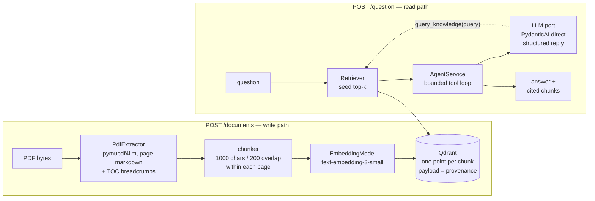

# RAG Agent — question answering over PDF manuals

Upload PDFs, ask questions in any language, get grounded answers together
with the exact excerpts they came from. Built for an ML Engineering
interview challenge ([brief](docs/challenge.md)), and built **eval-first**:
every retrieval and prompt change is measured against a hand-authored
golden dataset before it is kept. From day one the repo has carried a
**wiki-style knowledge base for the AI coding agents** that helped develop
it — the [documentation section](#documentation-a-wiki-for-the-agents-that-built-this)
explains how to read it in five minutes.


## Quickstart

You need Docker and an OpenAI API key. Nothing else.

```bash
git clone <this repo> && cd rag-agent
cp .env.example .env        # put your key in OPENAI_API_KEY
make up                     # builds the image, starts Qdrant + API in the foreground
```

In a second terminal, index the four motor manuals shipped in
`case_files/` (WEG and Baldor, Portuguese and English) and ask the
challenge's own example question:

```bash
curl -s -F "files=@case_files/LB5001.pdf" \
        -F "files=@case_files/MN414_0224.pdf" \
        -F "files=@case_files/WEG-CESTARI-manual-iom-guia-consulta-rapida-50111652-pt-en-es-web.pdf" \
        -F "files=@case_files/WEG-motores-eletricos-guia-de-especificacao-50032749-brochure-portuguese-web.pdf" \
        http://localhost:8000/documents
# {"message":"Documents processed successfully","documents_indexed":4,"total_chunks":570}

curl -s -X POST http://localhost:8000/question \
        -H 'Content-Type: application/json' \
        -d '{"question": "What is the power consumption of the motor?"}'
```

Indexing the four PDFs takes about a minute; the `make up` terminal shows
one log line per file and stage while it runs. Interactive OpenAPI docs
live at <http://localhost:8000/docs>.

## The API

| Endpoint          | Request                                              | Response                                                     |
| ----------------- | ---------------------------------------------------- | ------------------------------------------------------------ |
| `POST /documents` | `multipart/form-data`, one or more PDFs under `files` | `{"message", "documents_indexed", "total_chunks"}`           |
| `POST /question`  | `{"question": "..."}`                                | `{"answer", "references": [verbatim excerpts the answer cites]}` |
| `GET /health`     | —                                                    | `{"status": "ok"}`                                           |

Error semantics are deliberate: a non-PDF upload is a `422` naming the
offending file and nothing is indexed (all-or-nothing); a blank question is
a `422`; provider failures surface as `502` with the provider named.
Re-uploading a file is idempotent — chunk ids are content-addressed, so
the index never accumulates duplicates.

### Example requests and responses

Real outputs from the running stack (`openai:gpt-5-mini`, the 570-chunk
corpus). References are shown truncated; the API returns the full chunk
text.

**The challenge's example question** — answered from the WEG guide's
conceptual section, in the question's language:

```json
{"question": "What is the power consumption of the motor?"}
```

```json
{
  "answer": "The motor's power consumption is the electrical power absorbed from the network (Pa). This absorbed power is always greater than the mechanical power available at the shaft (Pu) due to the motor's losses; the efficiency η is the ratio Pu / Pa.",
  "references": [
    "www.weg.net \n\n#### 1.2.6 Rendimento \n\nO rendimento define a eficiência com que é feita a conversão da energia elétrica absorvida da rede pelo motor, em energia mecânica disponível no eixo. …",
    "mostrado no tópico 1.2.6, em todos os motores elétricos, a potência elétrica absorvida é sempre maior que a potência mecânica disponível na ponta de eixo, ou seja, a potência consumida na rede elétrica é sempre maior que …"
  ]
}
```

**A maintenance question in Portuguese** — the answer separates the two
manuals that speak about grease:

```json
{"question": "Qual graxa devo usar para relubrificar os rolamentos do motor?"}
```

```json
{
  "answer": "Conforme os documentos fornecidos:\n- Para motores Baldor: usar Polyrex EM (Exxon Mobil) — os motores são pré-lubrificados com essa graxa; se optar por outra, consulte um Centro de Serviço Baldor (Baldor). (fonte: documento Baldor)\n- Para proteger retentores externos de redutores em períodos sem funcionamento (>6 meses): aplicar uma fina camada de graxa NLGI #2 EP, por exemplo Texaco Multifak EP2, e remover antes da operação. (fonte: manual WEG)",
  "references": [
    "… Lubrication interval for 6313 or 6314 bearings that are used in 360 through 5000 frame, 2 pole motors. If roller bearings are used, bearings must be lubricated more frequently …",
    "… O eixo de entrada do redutor deverá ser girado no mínimo duas voltas completas e este procedimento deverá ser repetido, no mínimo, 1 vez a cada 2 meses. …"
  ]
}
```

When the indexed documents do not support an answer (for example _"Qual é
a capital da Austrália?"_) the agent refuses in the question's language
and returns an empty `references` list — it never invents a source.
Questions take several seconds each (7–20 s observed): one or two LLM
calls plus retrieval.

## How it works



The codebase is a **ports & adapters "lite"**
([architecture](docs/architecture.md), [Decision 0004](docs/decisions/0004-ports-and-adapters-lite.md)):
a framework-free domain (`src/domain`: dataclass entities, `typing.Protocol`
ports, two domain services) surrounded by adapters per pipeline stage, wired
in one composition root at the API edge. The point is cheap experiments:
swapping the PDF extractor, the embedder, the retrieval strategy or the LLM
provider is a one-line change, and the evals decide whether it stays.

Answering is **dual-path** ([Decision 0005](docs/decisions/0005-retrieval-architecture.md)):
a deterministic seed retrieval puts the top-k chunks in front of the model
as an XML-rendered context, and the model may call a `query_knowledge`
tool (at most 3 rounds) against the same retriever when the seed is not
enough. The final turn is a **provider-enforced structured reply** — answer
text, the ids of the chunks it actually cites, and a `has_answer` flag
([Decision 0009](docs/decisions/0009-structured-reply-function-tools.md)) —
so `references` carries exactly what grounded the answer, never
everything that was retrieved. The prompt is a deliberate, reviewed
artifact in `src/domain/services/prompts.py`, not a string buried in a
route.

```
src/domain/       entities, ports (Protocols), AgentService, IngestionPipelineService, prompts — pure Python
src/ingestion/    pymupdf4llm extractor, fixed-size chunker
src/retrieval/    OpenAI embedder, Qdrant store, VectorRetriever
src/llm/          PydanticAiLLM adapter (structured output, function-derived tools)
src/api/          FastAPI routes + composition root
src/evaluation/   the eval harness (loader, matching, metrics, report, CLI)
evals/            golden dataset (93 cases) and committed results
tests/            115 tests — domain services against fakes, adapters, route and seam integration
docs/ specs/ research/   the knowledge bundle (see below)
```

## Eval-first

Accuracy is measured, not assumed ([development workflow](docs/development-workflow.md)).

- **Golden dataset** — 93 hand-authored question → ideal-answer cases over
  the four manuals ([overview](evals/golden/golden-dataset.md)): operator
  and technical personas, table and figure lookups, cross-lingual cases
  (English manuals asked in Portuguese and vice-versa), and 8 unanswerable
  controls. Ground truth is verbatim excerpts plus page, never chunk ids,
  so it survives any change in chunking.
- **Metrics** ([Decision 0006](docs/decisions/0006-eval-metrics-and-golden-dataset.md))
  — deterministic **gates** decide experiments: recall@5, hit_rate@5,
  MRR@5. Diagnostics (precision@5, per-slice breakdowns by document,
  language, persona and category) explain the numbers but never gate.
- **The rule** — any change to chunking, embedding, retrieval or prompting
  ships with a before/after run committed to `evals/results/`.

```bash
make install                      # local venv, Python >= 3.12
make eval label=my-experiment     # runs against the eval collection, prints deltas vs the last run
make eval-fresh label=reindexed   # drop the eval collection and re-ingest first (after ingestion changes)
```

### Scoreboard

The table is alive: every kept experiment adds a row, with its committed
results file as evidence. The goal is to leave the best numbers we can
reach here.

| Iteration | Date | Results | recall@5 | hit_rate@5 | MRR@5 |
| --------- | ---- | ------- | -------: | ---------: | ----: |
| **Baseline** — pymupdf4llm without OCR, fixed 1000/200 chunks, `text-embedding-3-small`, top-5 vector search | 2026-09-01 | [`20260901-190240-baseline.json`](evals/results/20260901-190240-baseline.json) | 0.65 | 0.66 | 0.60 |

Gates are computed over the 83 gated cases (93 minus 8 unanswerable
controls and 2 image-only diagnostics). The baseline's two known failure
axes, both deliberately indexed so the first improvements are measurable:

1. **A broken PDF text layer.** The WEG-CESTARI manual has a partially
   corrupted font map; its middle pages extract as replacement characters.
   An OCR quality gate is the first planned experiment.
2. **Cross-lingual retrieval.** Portuguese questions against the English
   manuals miss far more than same-language ones; hybrid (BM25 + vector)
   or multilingual embeddings are the candidates, with the
   [evidence](research/retrieval-strategy-evidence.md) already gathered.

Answer-layer gates (fact recall, citation precision/recall, refusal rate)
are the next harness increment and will join this table.

## Engineering practices

- **Testing-first.** Every module and every seam between modules was
  built red-green-refactor: domain services against fakes of their ports,
  adapters on their own, routes with dependency overrides, seams on an
  in-memory Qdrant. External services are faked in tests; their real
  behavior is the evals' job. `make test` — 115 tests in about 3 s.
- **Typed.** `make typecheck` — pyright in `standard` mode, zero errors,
  no blanket ignores.
- **Comment-free code, documented decisions.** Rationale lives in the
  knowledge bundle next to the code it explains, not in comments that
  drift.
- **Runs on Python 3.12, 3.13 and 3.14** with the same pinned
  requirements; the image ships 3.14.

## Configuration

Copy `.env.example` to `.env`. Only the first variable is required.

| Variable                  | Default                  | What it does                                                                      |
| ------------------------- | ------------------------ | --------------------------------------------------------------------------------- |
| `OPENAI_API_KEY`          | —                        | Used for embeddings and the LLM. **Required.**                                    |
| `LLM_MODEL`               | `openai:gpt-5-mini`      | Any PydanticAI model string; `openai:` is the Responses API, `openai-chat:` Chat Completions. |
| `EMBEDDING_MODEL`         | `text-embedding-3-small` | `text-embedding-3-small` or `text-embedding-3-large` (changing it requires re-indexing). |
| `RETRIEVAL_K`             | `5`                      | Chunks per retrieval (seed and tool calls).                                       |
| `AGENT_MAX_TOOL_ROUNDS`   | `3`                      | Cap on `query_knowledge` rounds per question; `0` disables the tool.              |
| `QUERY_KNOWLEDGE_ENABLED` | `true`                   | Offer the retrieval tool to the model at all.                                     |
| `QDRANT_URL`              | `http://localhost:6333`  | Host-side default; inside compose the API talks to the `qdrant` service.          |
| `QDRANT_COLLECTION`       | `chunks`                 | Production collection.                                                            |
| `EVAL_QDRANT_COLLECTION`  | `eval_chunks`            | Separate collection the eval harness indexes and reads.                           |

Other providers are one extra and a model string away — the LLM adapter is
PydanticAI's direct API and its `FallbackModel` path is open
([Decision 0008](docs/decisions/0008-question-agent-baseline.md)); only the
OpenAI extra is installed today.

## Documentation: a wiki for the agents that built this

This repository was developed with AI coding agents, and we chose from the
very first commit to sustain it with a **wiki-style knowledge base written
for those agents**. The whole repo is one knowledge bundle in the
[Open Knowledge Format](docs/okf-spec.md): every `.md` file carries typed
frontmatter, module knowledge sits next to the module's code, and every
change to the bundle is logged. It holds what the code cannot say — why
things are shaped this way, what was rejected, what was measured — so that
each new agent session (and each human reader) starts with the same
context instead of reverse-engineering it from git history.

The bundle is curated: the owner is its editor, approves every new
concept before it is written, and stamps what he has reviewed
(`verified`). Agents propose, humans decide.

**A five-minute reading path for a human evaluator:**

1. [`docs/golden-rules.md`](docs/golden-rules.md) — the challenge's six
   criteria, adopted as the north star every tradeoff is resolved against.
2. [`docs/architecture.md`](docs/architecture.md) — the operating map:
   shape, rules, how to extend.
3. [`docs/decisions/`](docs/decisions/index.md) — ten decision records,
   each with context, alternatives rejected and consequences. Start with
   [0004](docs/decisions/0004-ports-and-adapters-lite.md) (architecture),
   [0005](docs/decisions/0005-retrieval-architecture.md) (retrieval and
   the dual-path agent), [0006](docs/decisions/0006-eval-metrics-and-golden-dataset.md)
   (eval metrics), [0009](docs/decisions/0009-structured-reply-function-tools.md)
   (structured replies) and [0010](docs/decisions/0010-examiner-developer-ux.md)
   (developer UX).
4. [`log.md`](log.md) — the bundle's changelog, newest first: the story of
   the project in one page.

## What's next

Eval-gated, in this order:

- An **OCR quality gate** in ingestion, measured on the CESTARI canary.
- **Cross-lingual retrieval** — hybrid BM25 + vector search or a
  multilingual embedding model, measured on the `language` slice.
- **Answer-layer evals** — fact recall, citation precision/recall and
  refusal rate over the golden dataset, so prompt changes are gated too.
- **Per-request observability** — latency attributed to retrieval, tool
  rounds and structured output.

## Challenge deliverables

- [x] Complete implementation — `POST /documents`, `POST /question`, the
  contract exactly as specified
- [x] Setup and run instructions — [Quickstart](#quickstart), Docker only
- [x] Example requests and expected responses — [above](#example-requests-and-responses), real outputs
- [x] Environment variables and API keys — [Configuration](#configuration)
- [x] Optional: Dockerized environment and Makefile
- [x] Optional: logging — per-file ingestion progress and request logs in the compose output
- [x] Optional: multiple LLM providers — PydanticAI adapter with the fallback path open
- [ ] Optional: frontend — not built; the OpenAPI UI at `/docs` is the interactive surface
